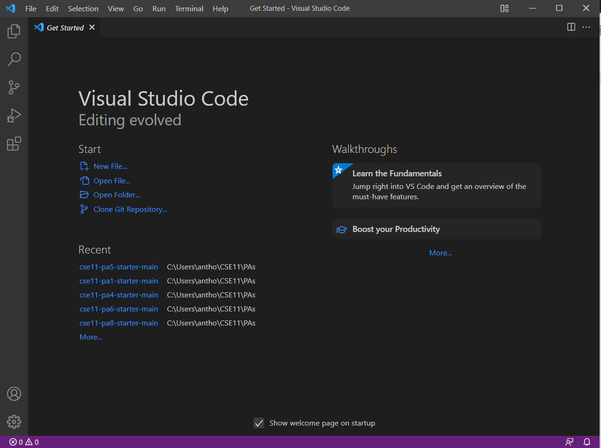
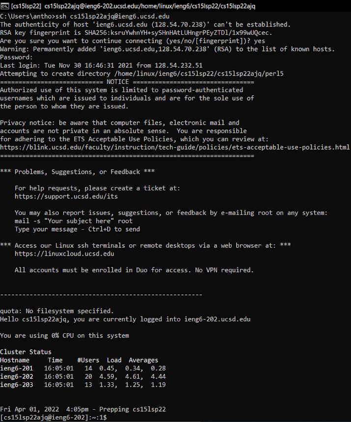
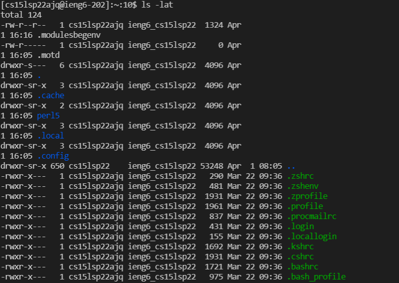
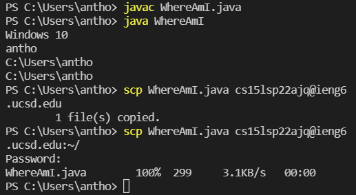
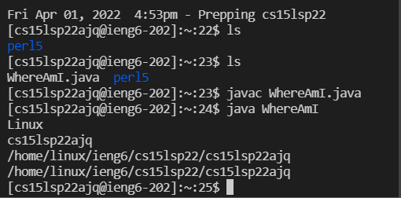
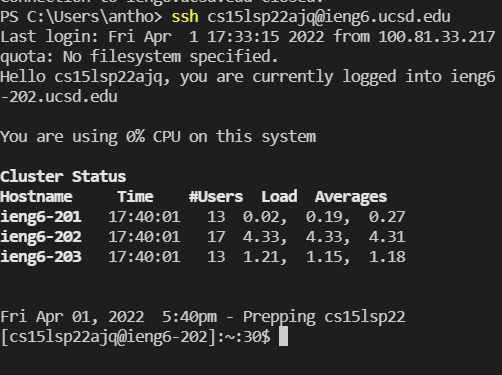

# Setting up and logging into a course specific ieng6 account

## Install VSCode
Go to the [Visual Studio Code Website](https://code.visualstudio.com/) and follow the instructions to install VSCode based on your operating system. 

After installing and opening the program, a window like below should show up.



## Remotely Connecting

If you're on a Windows operating system, the first step you need to complete is installing OpenSSH. Follow the steps [here](https://docs.microsoft.com/en-us/windows-server/administration/openssh/openssh_install_firstuse).

Then, use [this link](https://sdacs.ucsd.edu/~icc/index.php) to look up your course-specific ieng6 account. 

Open a terminal in your VSCode and type in the following command: 

```
ssh <course-specific-account-name>
```

Say yes to whatever questions they give you, then enter your password when prompted. The entire process should look something like this:



## Trying Some Commands ##

After connecting your terminal to the server, any commands you run on that terminal will run on the server as well. Try running a couple commands like `ls`, `cd`, `mkdir`, and `ls -lat`. 

Below is what happens when I run `ls -lat` in my terminal logged onto my `cs15lsp22` account:



## Moving Files with `scp`

Create a file called WhereAmI.java with the following code:

```
class WhereAmI {
  public static void main(String[] args) {
    System.out.println(System.getProperty("os.name"));
    System.out.println(System.getProperty("user.name"));
    System.out.println(System.getProperty("user.home"));
    System.out.println(System.getProperty("user.dir"));
  }
}
```

Try compiling it and running it on your client-sided terminal and record the results. Essentially, what the program does is print out the operating system name, and user home and directory of whatever system is running it. This allows us to tell where the program is being run from. 

To copy the file onto the server, run this command:

`scp WhereAmI.java <course-specific-account-name>:~/`

Enter your password when prompted then return to your ieng6 terminal and run the program. The output should be somewhat as follows:




## Optimizing Remote Running

Logging in and copying files over using `scp` are very time-expensive because they require you to type your password each time. 

We can optimize remote running by adding SSH Keys, using `ssh-keygen` and following the directions [here](https://docs.microsoft.com/en-us/windows-server/administration/openssh/openssh_keymanagement#user-key-generation).

Setting up SSH Keys allows us to login to ieng6 and `scp` files without entering a password each time. 



As we can see above, I'm now able to log in to my ieng6 account without typing a password.

