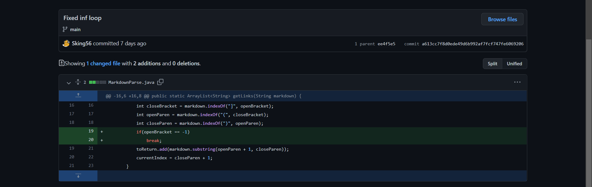
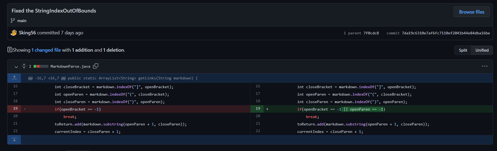
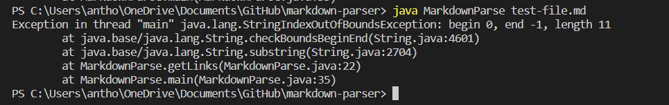
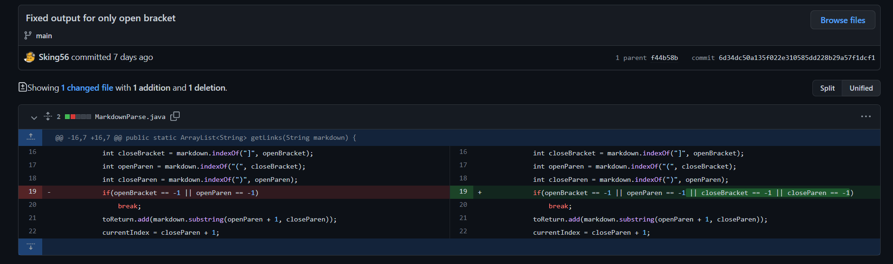

# Week 4 Lab 2

## First Code Change



[Failure-Inducing Input](https://github.com/Sking56/markdown-parser/commit/ee4f5e52e3371bffd4c01c796502c5bd97b3deb2)

Symptom of failure-inducing input:
```
Exception in thread "main" java.lang.OutOfMemoryError: Java heap space
```


The symptom is that we are running out of memory, or Java heap space, as stated in the exception message. This symptom is caused by an infinite while loop, the bug in this scenario. The bug, the infinite while-loop, occurs because of the failure-inducing input, in which we have an extra new line after the last character in the .md file, causing the current index to not be able to increment past markdown.length due.

## Second Code Change



[Failure-Inducing Input](https://github.com/Sking56/markdown-parser/commit/7f0cdc8f1b319166ae710b8eff0ef7e8116ed04b)

Symptom of failure-inducing input:
```
Exception in thread "main" java.lang.StringIndexOutOfBoundsException:
begin 0, end -1, length 11
```



The symptom is that we have an IndexOutOfBoundsException. This is because we are calling .substring() with args that are out of bounds of the string (this is the bug). In the failure-inducing input, the text does not contain any parenthesis after the brackets and thus nothing should output. However, because .indexOf() returns -1 when the character is not present, closeParen is set to -1 and thus results in the symptom of an OutOfBoundsException beacuse -1 is out of bounds when called as an arg for .substring(). 

## Third Code Change



[Failure-Inducing Input](https://github.com/Sking56/markdown-parser/commit/f44b58ba229dbb78ccfec04fb6106581a73ab687)

Symptom from failure-inducing input:

```
[Something]
```


The symptom is that [Something] is output when the output should just be an empty array. The bug causing this is the fact that our code will still search for a open parenthesis and close parenthesis even if the close bracket is missing (-1 integer value), the .substring will still find the "something" and output it, even when nothing should output. The failure-inducing input is missing a close bracket, thus it induces the symptom. 