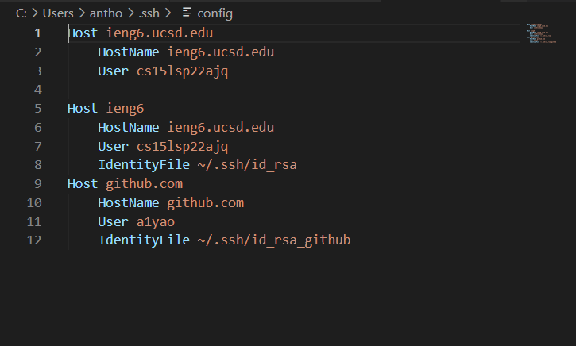
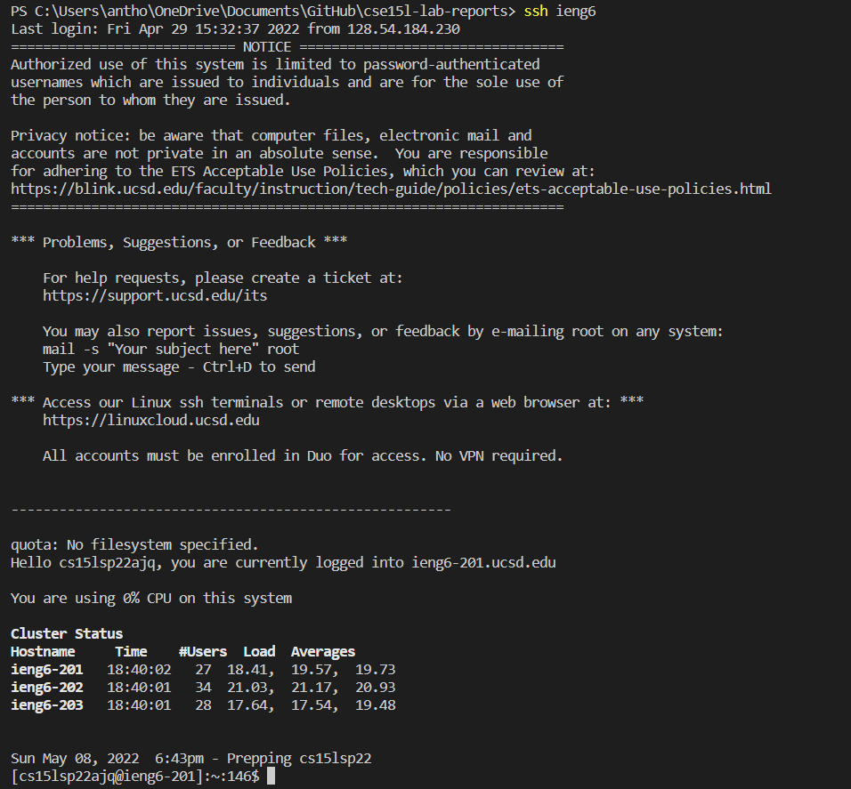
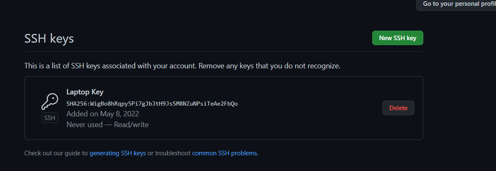
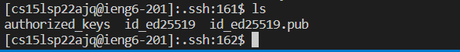
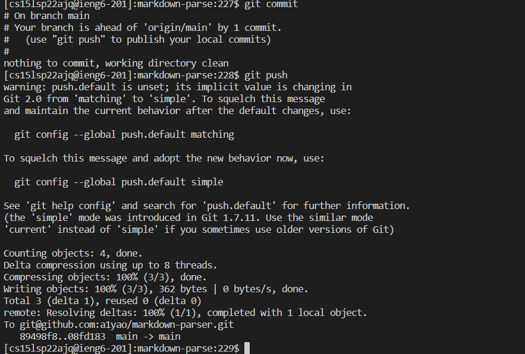
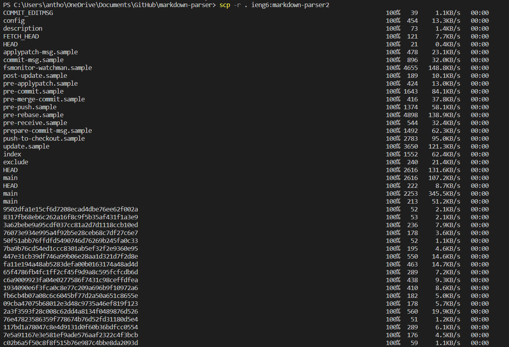
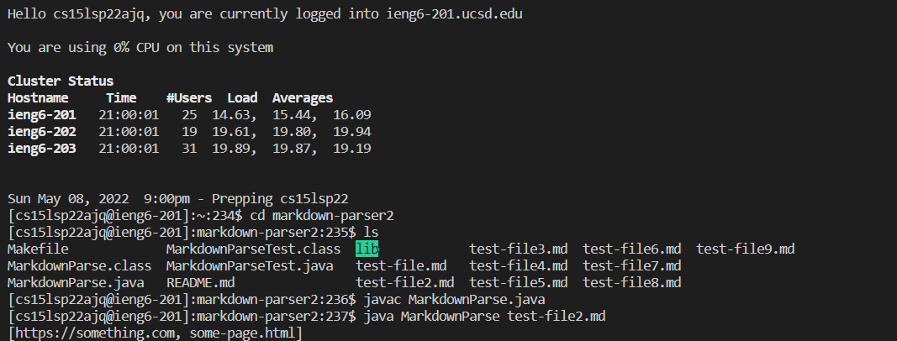
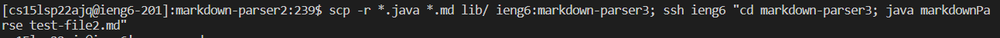

# Week 6 Lab 4

## Streamlining `ssh` Configuration

My `.ssh/config` file:

Using the command `ssh ieng6` to login using just my alias:

Copying over with just the alias:

## Setup Github Access from ieng6

Public key on Github:

Public and private key on the ieng6 server in .ssh:

[Committing](https://github.com/a1yao/markdown-parser/commit/08fd183c242087a083fc3b5ad0d3075e6ae5bcad) and pushing on ieng6:

## Copy whole directories with `scp -r`

Copying over the entire markdown-parser directory:

Compiling and running in the copied directory on ieng6:

Using `scp`, `;`, and `ssh` to copy the whole directory and run the code in one line:

