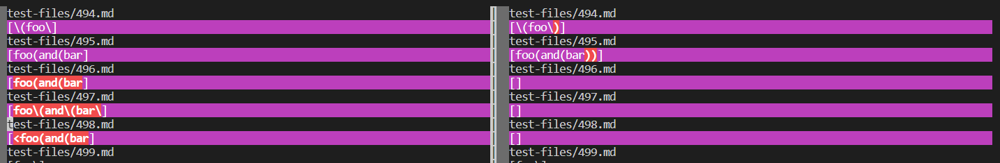
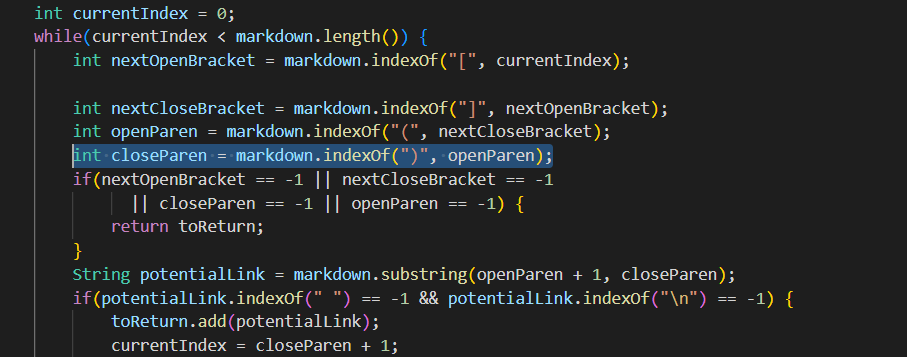

# Week 10 Lab 5

I used `vimdiff` to compare my two `result.txt` files and find the test with different outputs.



The two tests I will be focusing on in this report will be [494.md](https://github.com/nidhidhamnani/markdown-parser/blob/main/test-files/494.md) and [496.md](https://github.com/nidhidhamnani/markdown-parser/blob/main/test-files/496.md).

## 496.md

For test 496.md, the lab 9 implementation is correct, giving an output of `[]`. We doublecheck this using CommonMark, where we can see that the .md code in preview form remains the same and does not change into a hyperlink. 

Actual Output:
```
[foo(and(bar]
```

Expected output:
```
[]
```

The issue with my program for this test is that it does not check for valid parenthesis. Because there are three open parenthesis and only 2 close parenthesis, one parenthesis is missing a close parenthesis. This means that the link is not valid and thus should not display in the output. The code that needs to be fixed is the same line of code as shown in test 494.md:



## 494.md

For test 494.md, the lab 9 given implementation gives the correct output of `[\(foo\)]`. We doublecheck this using CommonMark, which shows that the hyperlinked text leads to `\(foo\)`. 

Expected Output:
```
[\(foo\)\]
```
Actual Output:
```
[\(foo\]
```

The issue with my program is that rather than looking for the closing parenthesis that corresponds to the first open parenthesis, it looks for the first closed parenthesis after the open parenthesis. The code that needs to changed is shown highlighted in the code below. Even though the highlighted portion is the same as the first test file error, what needs to be added is different so the tests have different bugs. In the first test file, the error can be fixed simply by adding a valid parenthesis checker. However, to fix this bug, we must additionally make sure that the link that is added to the list includes all the parenthesis until the last parenthesis. 

If this is still not considered different bugs, I am unsure how I can earn full credit on this lab report because all of the differences between my implementation and the lab's implementations involve parenthesis which require a change in the same line of code that's highlighted. 


